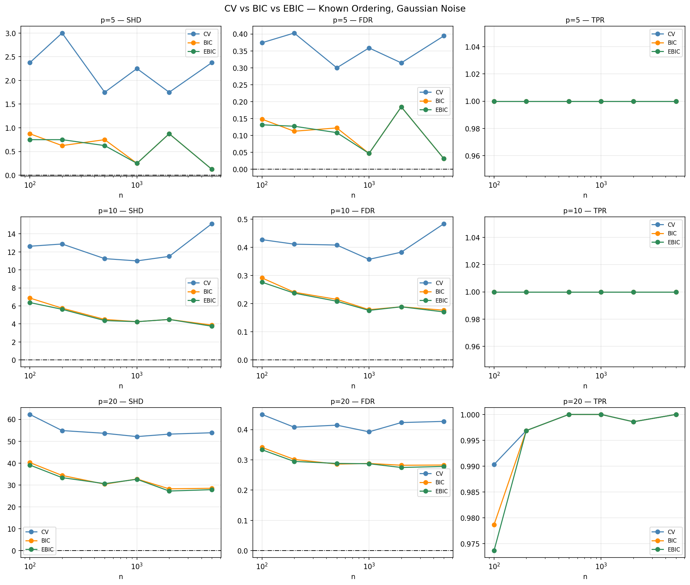
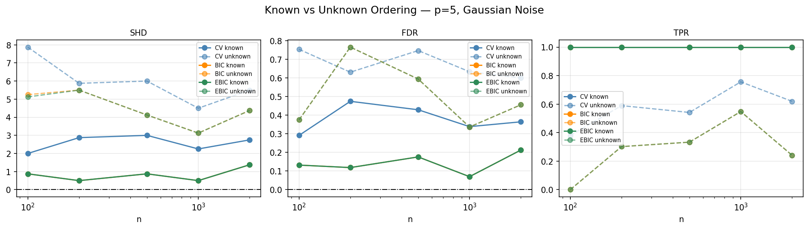
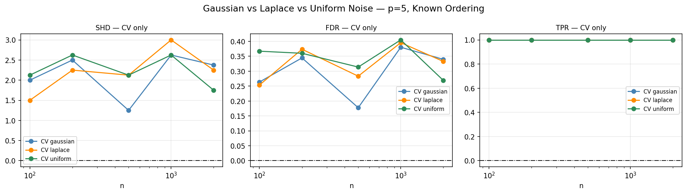

# CV Inconsistency for DAG Structure Learning

Empirical replication of the cross-validation inconsistency result for DAG structure learning, based on Corollary 6 of:

> Lyu, Tai, Kolar, Aragam. *Inconsistency of Cross-Validation for Structure Learning in Gaussian Graphical Models*. AISTATS 2024.

## Overview

Cross-validation (CV) is the standard method for hyperparameter selection in machine learning. However, Lyu et al. (2024) prove that CV is provably inconsistent for structure learning. Even with infinite data, CV selects too many edges and never recovers the true graph.

This project replicates that result empirically for DAGs using nodewise Lasso regression across three settings: known ordering with varying graph sizes, unknown ordering, and non-Gaussian noise. Lambda selection criteria compared: CV (5-fold cross-validation), BIC, and EBIC.

## Results

**Experiment 1: Known ordering, varying graph size (p = 5, 10, 20)**



CV's SHD never reaches zero regardless of sample size. EBIC improves consistently. The gap grows larger as p increases.

**Experiment 2: Unknown ordering (p = 5)**



Unknown ordering roughly doubles SHD across all methods, suggesting Corollary 6 is optimistic. CV fails even more severely when the ordering must be inferred.

**Experiment 3: Non-Gaussian noise (p = 5)**



CV remains inconsistent under Laplace and Uniform noise, suggesting the inconsistency is driven by the prediction-vs-structure objective mismatch rather than Gaussian assumptions.

## Full writeup

See `Mete_Ehliz_CV-DAG-Findings.pdf` for the complete findings.

## How to run

```bash
pip install numpy matplotlib scikit-learn
python3 simulation.py
```

## Dependencies

numpy, matplotlib, scikit-learn
