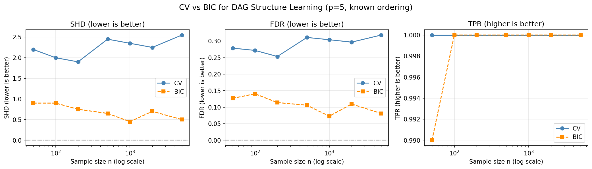

# CV Inconsistency for DAG Structure Learning

Empirical replication of the cross-validation inconsistency result for DAG structure learning, based on Corollary 6 of:

> Lyu, Tai, Kolar, Aragam. *Inconsistency of Cross-Validation for Structure Learning in Gaussian Graphical Models*. AISTATS 2024.

## Overview

Cross-validation (CV) is the standard method for hyperparameter selection in machine learning. However, Lyu et al. (2024) prove that CV is provably inconsistent for structure learning — even with infinite data, CV selects too many edges and never recovers the true graph.

This project replicates that result empirically for DAGs using nodewise Lasso regression, comparing two lambda selection criteria: CV (5-fold cross-validation) which is inconsistent, and BIC (Bayesian Information Criterion) which is consistent.

## What the code does

1. Generates data from a known 5-node Gaussian DAG
2. Learns the DAG using Lasso with CV vs BIC selected lambda
3. Measures performance using SHD, FDR, and TPR across sample sizes n = 50 to 5000
4. Plots results showing CV never recovers the true graph while BIC improves consistently

## Results



CV's SHD never reaches zero regardless of sample size, confirming the inconsistency result from Corollary 6. BIC improves consistently with more data.

## How to run

```bash
pip install numpy matplotlib scikit-learn
python3 "1st project.py"
```

## Dependencies

numpy, matplotlib, scikit-learn
